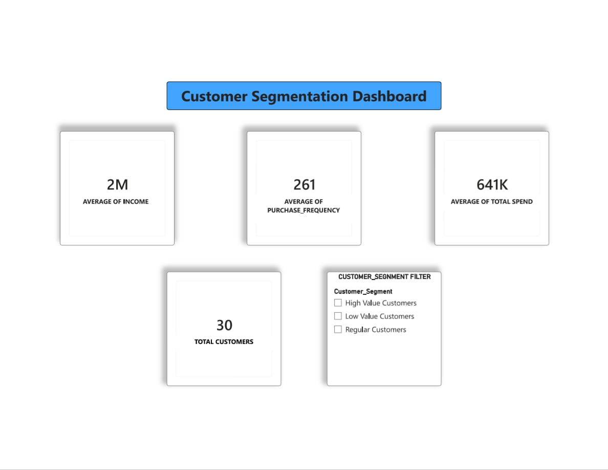
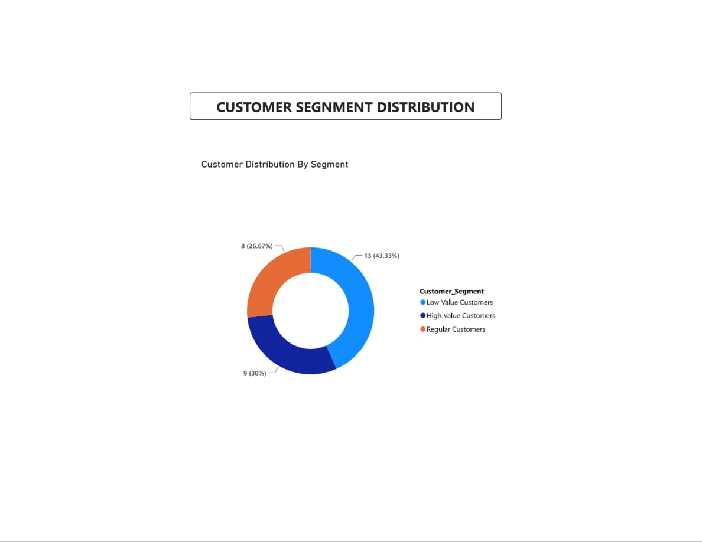
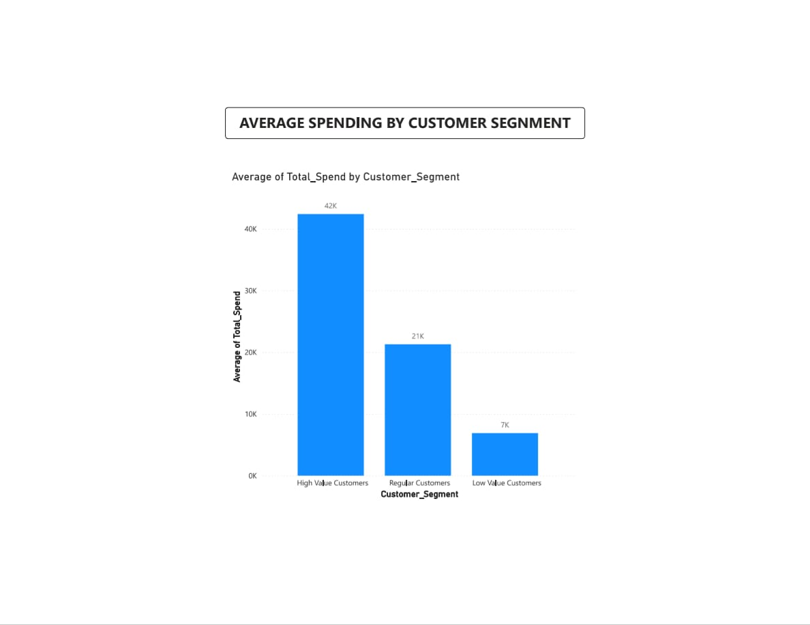
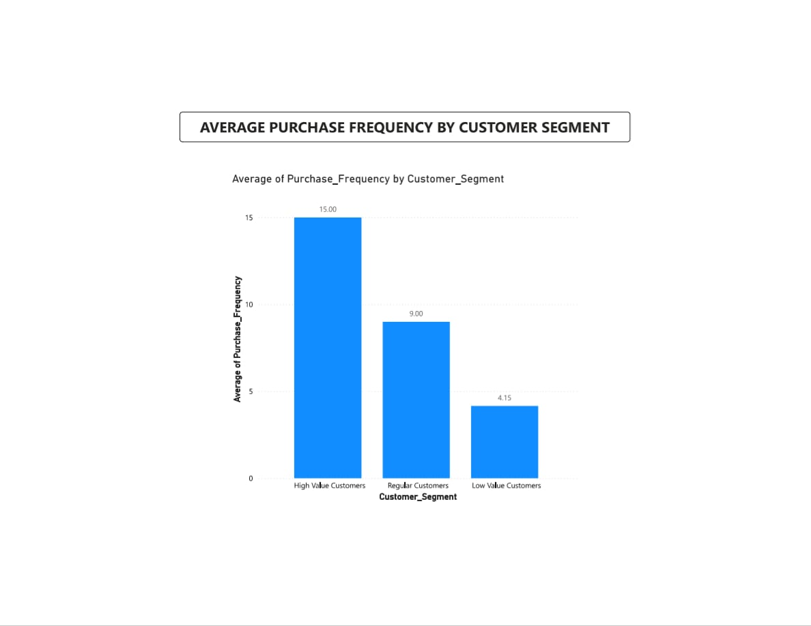
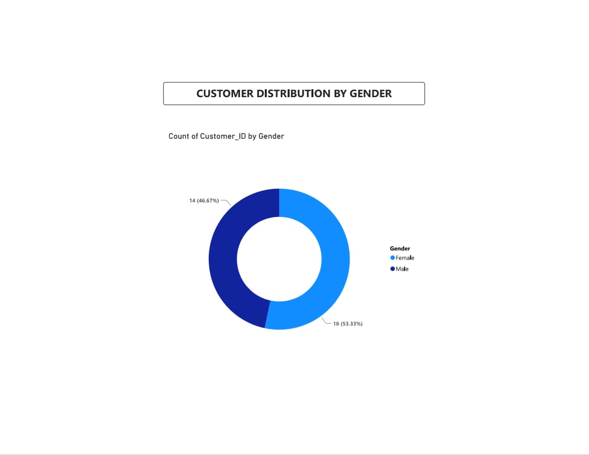

# Customer-Segmentation-Analysis
Customer segmentation project using Python, K-Means clustering, and Power BI to analyze customer behavior, spending patterns, and purchase frequency.

# Customer Segmentation Analysis

## Project Overview

This project focuses on customer segmentation using Python and Power BI. The main objective is to group customers based on their purchasing behavior, spending patterns, income, and purchase frequency.

## Tools & Technologies

- Python
- Pandas
- Scikit-learn
- K-Means Clustering
- Excel
- Power BI

## Project Workflow

1. Imported and cleaned the customer dataset.
2. Used K-Means clustering to segment customers.
3. Analyzed customer income, total spending, and purchase frequency.
4. Created customer segment labels:
   - High Value Customers
   - Regular Customers
   - Low Value Customers
5. Built an interactive Power BI dashboard to visualize customer segments and insights.

## Dashboard Features

- Total Customers
- Average Income
- Average Purchase Frequency
- Average Total Spend
- Customer Segment Filter
- Customer Segment Distribution
- Average Spending by Customer Segment
- Average Purchase Frequency by Customer Segment
- Customer Distribution by Gender

## Customer Segments

### High Value Customers
Customers with higher income, higher spending, and frequent purchases.

### Regular Customers
Customers with moderate spending and purchase frequency.

### Low Value Customers
Customers with lower spending and relatively lower purchase frequency.

## Files Included

- `Customer_Segmentation_Dataset.xlsx` – Original customer dataset
- `Customer_Segmentation_Result.xlsx` – Dataset with customer segment results
- `customer_segmentation.py` – Python clustering and segmentation code
- Power BI Dashboard – Interactive dashboard for customer analysis

## Project Outcome

The project helps identify different customer groups and understand their purchasing behavior. These insights can support businesses in developing targeted marketing strategies and improving customer engagement.

## Power BI Dashboard Screenshots

### Page 1 – Customer Segmentation Dashboard

### Page 2 – Customer Segment Distribution

### Page 3 – Average Spending by Customer Segment

### Page 4 – Average Purchase Frequency by Customer Segment

### Page 5 – Customer Distribution by Gender

## Author

Baumika Ramanathan

